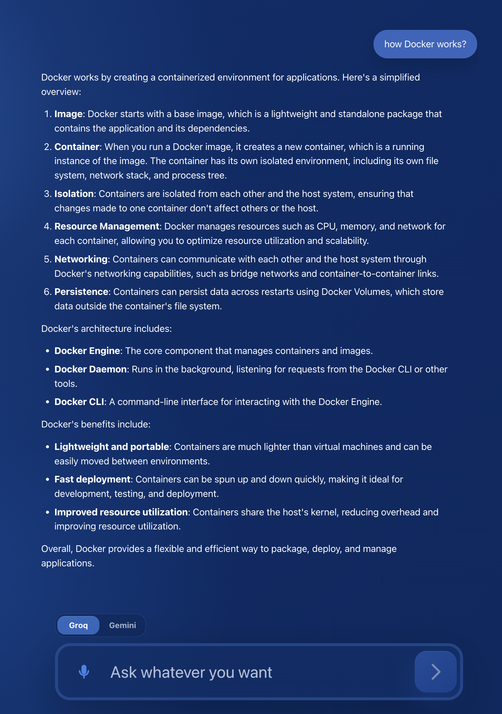
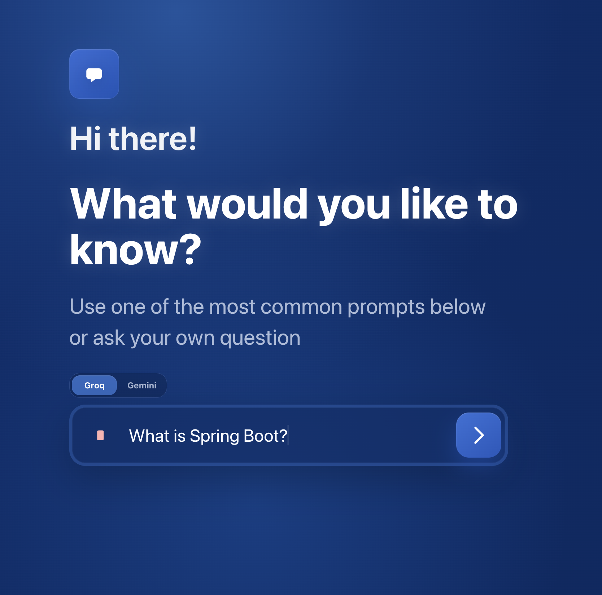

# AI Voice Chat Assistant

A fullstack AI chat assistant with text input, voice input, provider switching, and a clean ChatGPT-style conversation screen.

The project was built as a test assignment for a fullstack developer role. It includes a React frontend, a NestJS backend, AI provider integration, Web Speech API voice recognition, and Docker Compose setup for running the whole app with one command.

## Preview

| Start screen | Chat screen |
| --- | --- |
|  |  |

## Features

- Text chat interface with a minimal dark-blue UI.
- Voice input with the browser Web Speech API.
- Continuous voice recognition in Russian (`ru-RU`).
- Recognized speech is inserted into the input before sending.
- Chat view with user messages in bubbles and assistant replies as readable text.
- Markdown rendering for assistant responses, so lists and bold text display correctly.
- AI provider switcher on the frontend.
- Groq is used by default.
- Gemini remains available as an alternative provider.
- Backend validation and clean error responses.
- Docker Compose setup for frontend and backend.

## Tech Stack

### Frontend

- React
- TypeScript
- Vite
- CSS
- `react-speech-recognition`
- `react-markdown`
- Web Speech API

### Backend

- Node.js
- NestJS
- TypeScript
- `@nestjs/config`
- Groq SDK
- Google Gemini SDK

### Infrastructure

- Docker
- Docker Compose

## Project Structure

```text
.
├── backend
│   ├── src
│   │   ├── ai
│   │   ├── chat
│   │   ├── gemini
│   │   └── groq
│   ├── Dockerfile
│   └── .env.example
├── frontend
│   ├── src
│   ├── Dockerfile
│   └── .env.example
├── docs
│   └── screens
└── docker-compose.yml
```

## How It Works

The frontend sends the user's message to the backend through `POST /api/chat`.

The backend validates the request, selects the configured AI provider, sends the message to the provider API, and returns a normalized response to the frontend.

The AI integration follows a provider-style structure:

- `GroqService` handles Groq API calls.
- `GeminiService` handles Gemini API calls.
- `AiProviderService` selects which provider to use.
- `ChatController` only works with the common AI provider interface.

This keeps provider-specific logic separate from the chat endpoint and makes it easier to add more AI providers later.

## Environment Variables

Create `backend/.env` from `backend/.env.example`:

```bash
AI_PROVIDER=groq
GROQ_API_KEY=your_groq_api_key_here
GROQ_MODEL=llama-3.1-8b-instant
GEMINI_API_KEY=your_gemini_api_key_here
GEMINI_MODEL=gemini-2.5-flash-lite
```

`AI_PROVIDER` supports:

- `groq`
- `gemini`

If `AI_PROVIDER` is missing, the backend uses `groq` by default.

API keys are used only on the backend and must not be exposed to the frontend.

## Run With Docker

From the project root:

```bash
docker compose up --build
```

After startup:

- Frontend: `http://localhost:5173`
- Backend: `http://localhost:3000`

The frontend container proxies `/api` requests to the backend container through the Docker network.

## Run Locally

### Backend

```bash
cd backend
npm install
npm run start:dev
```

The backend listens on `PORT` or `3000` by default.

### Frontend

```bash
cd frontend
npm install
npm run start:dev
```

The frontend runs on `http://127.0.0.1:5173`.

## API

### `POST /api/chat`

Request body:

```json
{
  "message": "Hello",
  "provider": "groq"
}
```

`provider` is optional. Allowed values are `groq` and `gemini`.

Successful response:

```json
{
  "reply": "AI response here"
}
```

Error handling:

- Empty message returns `400`.
- Missing API key returns `500`.
- Invalid provider configuration returns `500`.
- Provider rate limits return `429`.
- Provider API failures return `502`.

## Voice Input

Voice input is implemented on the frontend with `react-speech-recognition`, which uses the browser Web Speech API.

When the microphone button is pressed:

1. The browser asks for microphone permission if needed.
2. Speech recognition starts with `ru-RU`.
3. Recognized text is inserted into the message input.
4. The user can stop recording manually or send the message.
5. Sending a message automatically stops voice recording.

Browser support depends on the Web Speech API implementation available in the user's browser.
